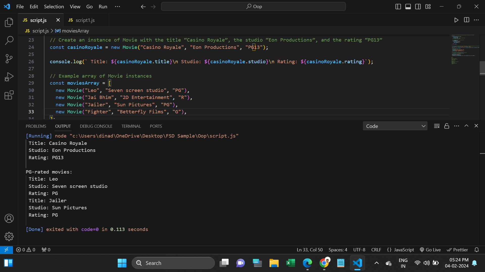
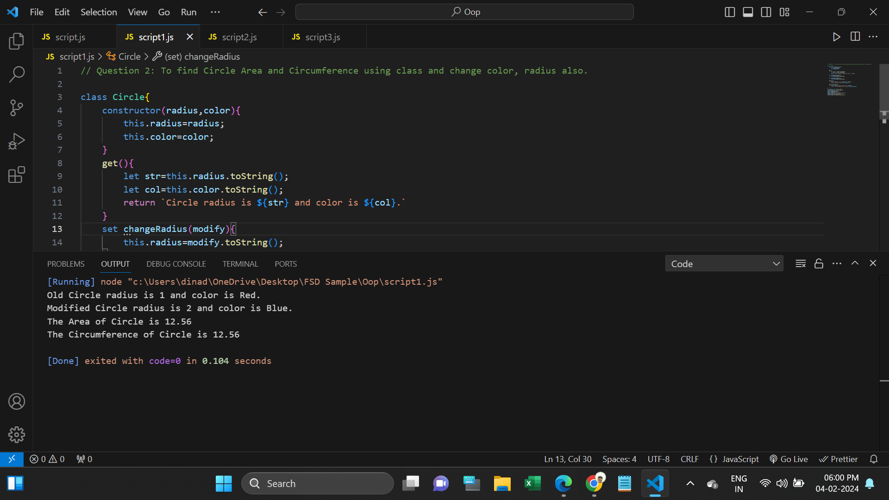
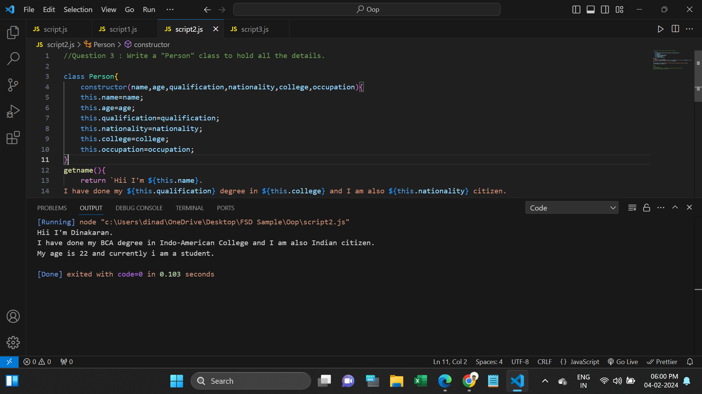
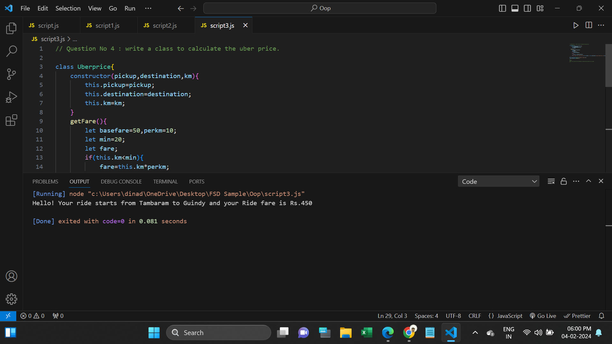

<h1>OOPS Task:</h1>
<h3>Class:</h3>

Classes are like blueprints for creating objects. They define how objects should be structured and what they can do.

<h3>Object:</h3>

Objects are like containers that can hold data (properties) and functions (methods).

<h3>Constructor:</h3>

The constructor() method is a special method for creating and initializing objects created within a class.

 

<h2>Questions</h2>

1. To print Movie title,studio and rating(if no rating print PG as default)

2. To find Circle Area and Circumference using class and change color, radius also.

3. Write a "Person" class to hold all the details.

4. write a class to calculate the uber price.

 

1. In script.js I Created Movie class for passing movie title, studio and rating.
If rating didn't give it will print rating PG as default.
and declared getPG method to get Array instances and print PG rated movies.

2. In script1.js I Created Circle class and pass radius value and color as string. then will be changed radius cnd color using set method. It getting Area of Circle in getArea method. It getting Circumference of circle in getCircumference method.

3. In script2.js I declared Person class and it will be hold all person details and then get and print in getname method.

4. In script3.js I declared Uberprice Class for calculating Uber price. In cost for Basefare is Rs.50 and Rs.10 per km. If passenger journy within 20 km basefare Rs.50 will not be calculated. or Passenger journy more 20km basefare Rs.50 will be calculated. 

 
<h2>Screenshots:</h2>

Script.js:

Script1.js:

Script2.js:

Script3.js:

